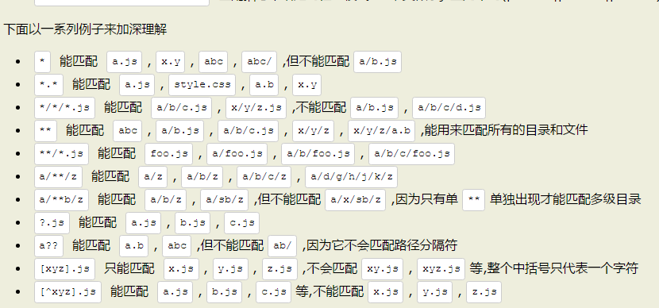

##### gulp
基于流的自动化构建工具
1、gulp.src()
在Gulp中，使用的是Nodejs中的`stream`（流），首先获取到需要的stream，然后可以通过stream的`pipe()`方法把流导入到想要的地方。`gulp.src()`方法是用来获取流的，但是注意这个流里的内容不是原始的文件流，而是一个虚拟文件对象流（`Vinyl files`），这个虚拟文件对象中存储着原始文件的路径、文件名、内容等信息

    gulp.src(globs[, options])
**globs**参数是文件匹配模式
**options**为可选参数

可以使用数组来匹配多种模式，好处就是可以很方便的使用排除模式，在数组中的单个匹配模式前加上`！`既是排除模式，它会在匹配的结果中排除这个匹配。注意：不能在数组中的第一个元素中使用排除模式。
**2、gulp.dest()**
该方法是用来写文件的，其语法为：

    gulp.dest(path,[, options])
要想更透彻的理解：
src获取到要处理的文件流，然后把文件流通过pipe导入到gulp插件中，最后把gulp插件处理后得流再通过pipe导入到gulp.dest()中，gulp.dest()方法则把流中的内容写入到文件中。
**3、gulp.task()**
gulp.task方法用来定义任务，语法：

    gulp.task(name[, deps], fn)
  **name**是任务名
  **deps**是当前定义的任务需要依赖的其他任务，为一个数组。当前任务会在所有依赖的任务执行完毕后才开始执行。如果没有依赖就省略。
  **fn**为任务函数，把任务要执行的代码都写在里面，该参数也是可选的。
  但是如果某个任务所依赖的任务是异步的，注意gulp并不会等待那个所依赖的异步任务完成，而是会接着执行后续任务。
  
    gulp.task('one',function(){
	  //one是一个异步执行的任务
	  setTimeout(function(){
	    console.log('one is done')
	  },5000);
	});
	
	//two任务虽然依赖于one任务,但并不会等到one任务中的异步操作完成后再执行
	gulp.task('two',['one'],function(){
	  console.log('two is done');
	});

  那如果想等待异步操作完再执行后续的任务呢？有三种方法可以实现：
 一：在异步操作完成后执行一个回调函数来通知gulp这个异步任务已经完成，这个回调函数就是任务函数的第一个参数。
  

    gupl.task('one',function(cb) {
		setTimeout(function() {
		cb();//执行回调
		}, 5000	
		);
	})
	gulp.task('two',['one'],function(){
		console.log('two');
	})
二： 定义任务时返回一个流对象。适用于任务就是操作gulp.src()获取到的流的情况。

    gulp.task('one',function(cb) {
	    var stream = gulp.src('client/**/*.js')
	    .pipe(dosomething())
	    .pipe(gulp.dest('build'));
	    return stream;
    })
	gulp.task('two',['one'],function(){
		console.log('two');
	})
	
三：返回一个promise对象，如

    var Q = require('q');//一个著名的异步处理的库
    gulp.task(
	    var deferred = Q.defer;
	    //做一些异步操作
	    setTimeOut(function() {
		    deferred.resolve();
	    }, 5000);
	    return deferred.promise;
    );
	gulp.task('two',['one'], function() {
		console.log('two is done');
	});
**4、gulp.watch()**
用来监视文件的变化，当文件发生变化之后，我们可以利用它来执行相应的任务。

    gulp.watch(glob[, opts], task)
 **tasks**为文件变化后要执行的任务，为一个数组
 还有一种用法：
 

    gulp.watch(glob[, opts, cb])
**cb**参数为一个函数，每当监视的文件发生变化时，就会调用这个函数，并且会给它传入一个对象，该对象包含了文件变化的一些信息，`type`属性为变化的类型，可以是`added`,`changed`,`deleted`;`path`属性为发生变化的文件的路径。

    gulp.watch('js/**/*.js', function(event){
    console.log(event.type); //变化类型 added为新增,deleted为删除，changed为改变 
    console.log(event.path); //变化的文件的路径
	});
**4、一些常用的gulp插件**
4.1 自动加载插件 `gulp-load-plugins`
4.2 重命名`gulp-rename`
用来重命名文件流中的文件。
4.3 js文件压缩`gulp-uglify`
用来压缩js文件，使用的是uglify引擎
4.4 css文件压缩`gulp-minify-css`
4.5 html文件压缩`gulp-minify-html`
4.6 js代码检查`gulp-jshint`
4.7 文件合并`gulp-concat`
用来把多个文件合并为一个文件，我们可以用它来合并js或css文件等，这就能减少页面的http请求数了。
4.8 less和sass的编译`gulp-less` `gulp-sass`
4.9 图片压缩 `gulp-imagemin`
来压缩 jpg png gif等图片
4.10 自动刷新 `gulp-livereload`
当代码变化时，它可以帮我们自动刷新页面。
 
