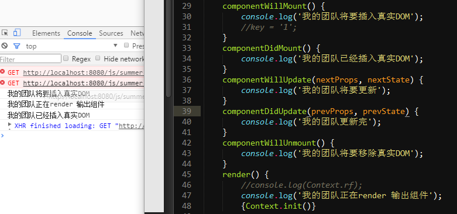
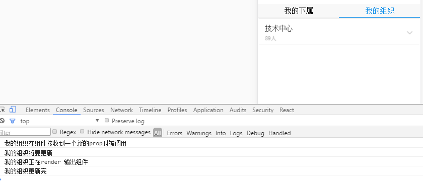

### React 初学注意点
##### state：
赋值不是this.state.id = '123'，而是`this.setState({id: '123'})`
因为API是：

    void setState(
		  function|object nextState,
		  [function callback]
	)
第二个方法会在设置完值后立即执行，当然也可以拿到新值。

    this.setState({content: 'abcd'},function(){
		console.log(this.state.content);
	})

在其他情况下，this.setState 是在 render 时， state 才会改变调用的。也就是说setState 是异步的。组件在还没有渲染之前， this.setState 还没有被调用。这么做的目的是为了提升性能，在批量执行 State 转变时让 DOM 渲染更快。
##### 输出组件的问题
1：声明的组件类名必须是大写。
因为： 规范。
组件的变量名必须大写，用于区分原生的Html标签和自定义组件。
2：添加组件属性，为了避免javascript的保留字。class属性需要写成className，for属性需要写成 htmlFor。
3：行内样式：有三处注意事项：驼峰式、引号、对象型。
因为: React 组件样式是一个对象，所以第一重大括号表示这是 JavaScript 语法，第二重大括号表示样式对象。
4：组件类只能包含一个顶层标签。
##### key
无论是循环，还是push到一个数组中，都需要唯一的key值来标识。否则会有warning。


刚开始我并没有给外层div给key，一直warning。我自己拼了一个key。
##### 关于方法绑定 this
ES6中，如果需要用到this，手动在构造方法里面绑定。

this.getInfo = this.getInfo.bind(this);

含有参数的方法：
onClick={this.getInfo.bind(this,jj.staff_id,jj.name)}

##### 组件之间传多个值
说一下传值吧。其实父组件还可以传多个值和方法作为属性给子组件。
比如说，父组件有两个方法
 m1(){},m2(params1,params2){}
还有两个值 a,b需要传给子组件。其实不需要一个一个穿，把这四个作为一个对象传递。
```
<Child parentProps={{a:this.state.a,b:this.state.b,m1:this.m1,m2:this.m2}}/>
```
这样就简洁许多。子组件调用
this.props.parentProps.a
##### setState尽量一次完成

### 使用心得
#### 起步：
因为网上许多文档都是用ES5语法写的，所以在此之前我整理了一下ES5语法和ES6语法的区别，看了会多一点了解，把ES5改为ES6语法就方便许多。
##### ReactDOM.render()
ReactDOM.render是React的最基本方法，**用于将模板转为HTML语言，并插入指定的DOM节点**。

##### JSX语法
允许HTML与js混写，HTML语言不需要加任何引号。

    var names = ['A','B','C'];
    ReactDOM.render(
		<div>
		{
		names.map(function (name) {
			return <div>Hello,{name}!</div>
		})
		}
		</div>,
		document.getElementById('example')
	);
上面代码体现了JSX基本语法规则：遇到HTML标签`<`开头的就是用HTML规则解析；遇到代码块`{`开头，就用js规则解析。
##### 组件
React允许将代码封装成组件，然后像插入HTML标签一样，在网页中插入这个组件。
ES5中React.createClass方法就用于生成一个组件类。

	var HelloMessage = React.createClass({
	    render: function() {
		    return <h1>Hello {this.props.name}</h1>;}
	    });

    ReactDOM.render(
		<HelloMessage name="wei"/>,document.getElementById('example');
	);
变量HeLLoMessage就是一个组件类。模板插入`<HelloMessage/>`时，会自动生成HelloMessage的一个实例。所有组件类都必须有自己的`render`方法，用于输出组件。
**组件类的第一个字母必须大写，否则会报错； 另外，组件类只能包含一个顶层标签（可能是为了父元素的唯一性吧）**

**添加组件属性，有需要注意的地方，为了避免javascript的保留字。class属性需要写成className，for属性需要写成 htmlFor**
##### this.props.children
this.props 对象的属性与组件的属性一一对应。但是有一个例外，就是`this.porps.children`属性，它表示组件的所有子节点。

this.props.children的值有三种可能，如果当前没有子节点，那就是`undefined`,如果有一个值，就是`Object`,如果有多个那数据类型就是 `Array`
##### PropTypes
组件类的PropTypes属性就是用来验证组件实例的属性是否符合要求。

    var My = React.createClass({
		propTypes: {
			title: React.PropTypes.string.isRequired,
		},
		render: function() {
			return <h1>{this.props.title}</h1>;
		}
	})
	//
	var data = 123;
	ReactDOM.render(<My title={data}/>, document.body);
此外，`getDefaultProps`方法可以用来设置组件属性的默认值。

##### 获取真实的DOM节点
组件并不是真实的DOM节点，而是存在于内存之中的一种数据结构，叫做 虚拟DOM。只有当它插入文档之后，才会变成真实的DOM。
有时候需要获取真实DOM节点，就要用到`ref`属性。

    var MyComponent = React.createClass({
	handleClick: function() {
		return this.refs.focus();
	},
	render: function() {
		return (
			<div>
			<input type="text" ref="myTextInput"/>
			<input type="button" value="" onclick={this.handleClick}
			</div>
		);
	}
	});
	//
	ReactDOM.render(
		<MyComponent/>,
		document.body
	);
##### this.state
组件需要和用户互动啊，导致状态变化，从而触发重新渲染UI。你可以把他想象成 专属于react的全局变量。但是很特殊，它是一个异步过程。
	
    //在构造方法中初始 this.state = {
	    id: '1'
    }
    if(this.state.id) {
	    this.setState({id : '2'});
	    //console.log(this.state.id)//输出1
    }
 我理解的异步过程是，他不会立即改变值，但是如果这个属性已经经历到了 render()方法那一步，他的值一定会更新。在除render之外是异步的。
 还有如果有多个state需要同时赋值，好的做法是

    this.setState({
	    a1: '1',
	    a2: '2',
	    a3: '3'
    })
不好的做法是

    this.setState({a1: '1'});
    this.setState({a2: '2'});
    this.setState({a3: '3'})

因为这样会使页面刷新三次，并不是我们想要的。
##### props
一个js对象，对应于dom的属性
原生属性：`className` 、`style`
新增属性：this.props.children 表示组件的所有子节点。
传递属性值：
**设置默认属性**
在ES6中： `defaultProps`(可以标识static定义在class内，也可以定义在class外)。
属性的读取： `this.props['propName']`
**属性类型**： 属性校验器propTypes
##### 表单

    class Example extends Component {
		constructor(props) {
			super(props);
			this.state = {
				value: 'hello'
			}//定义的时候就是以对象的方式，所以注定它就是对象。赋值不能是纯粹的=，而是setState
			handleChange(e) {
				this.setState({value: e.target.value})
			}	
			render() {
				let value = this.state.value;
				return (
					<input type="text" value={value} onChange={this.handleChange} />
			        <p>{value}</p>
				);
			}	
			}
	}

表单输入框的值，只能通过回调函数中的 `event.target.value`读取用户输入的值。

##### 组件的生命周期
组件的生命周期分为三个状态：

```
Mounting：已插入真实 DOM
Updating：正在被重新渲染
Unmounting：已移出真实 DOM
```

 
每个状态有两种处理函数，will是进入状态之前调用，did是之后调用。

```
componentWillMount() 将要插入真实dom
componentDidMount() 已经插入真实dom
//前两个一般发生在当前页面没有改组件，需要加载组件
componentWillUpdate(object nextProps, object nextState)在要加载组件的props或者state发生变化前即更新之前调用。
componentDidUpdate(object prevProps, object prevState)在要加载组件的props或者state发生变化后已经更新之后调用。
//这俩个一般发生在页面已经有了该组件并且需要更新，，或者初次加载组件
componentWillUnmount()
//这货是发生在要移除该页面啦，一般要取消定时器啊什么的，释放资源和内存吧
```
举例：
父组件加载过程。


父组件更新过程，一般发生在state或者props发生改变。

子组件加载和更新过程

三部分：第一部分是正常加载。第二部分是我在willComponent更改了state。第三部分呢是didComponent更改了state
此外，React 还提供两种特殊状态的处理函数。

    componentWillReceiveProps(object nextProps)：已加载组件收到新的参数时调用（一般就是 别的组件（比如说 父组件）传给他的值发生了变化，这个方法就会被触发）
	shouldComponentUpdate(object nextProps, object nextState)：组件判断是否重新渲染时调用（这个没用过，以后再补上）
	

    //父组件中有个子组件
    
    Class 父组件...
    this.state ={
	    parentid: '1'
    }
    //比如这里有个方法是改变parentid的
    method() {
	    this.setState({parentid: '2'});
    }
    return (
    //之前说过，setState是异步的，但是他一定会走到这里来的。这里parentid 是2
	    <div>
		    <Child id={this.state.parentid} />
	    </div>
    )
    //子组件
    class Child...
    //这个子组件的 componentWillReceiveProps(object nextProps) 会被触发。
    通过nextProps.id 拿到传来的值。如果没有触发父组件的method方法，这时候拿到的是1，如果触发了method方法，那么就是2.
栗子：

说一下传值吧。
上述只是传了一个值，其实父组件还可以传多个值和方法作为属性给子组件。
比如说，父组件有两个方法 m1(){...},m2(params1,params2){...},还有两个值 a,b需要传给子组件。其实不需要一个一个穿，把这四个作为一个对象传递。

    <Child parentProps={{a:this.state.a,b:this.state.b,m1:this.m1,m2:this.m2}} />

这样就简洁许多。
子组件 componentWillReceiveProps(object nextProps)接受参数。通过`nextProps.parentProps.a`和`nextProps.parentProps.a`获取参数值。
至于传来的方法，在子组件任何地方都可以调用，我认为的调用就是给父组件传值（或者父组件获取子组件的值）。要不然子组件直接调用父组件不符合常理。
调用方式通过`this.props.parentProps.m1`
传父组件参数过去就是`this.props.parentProps.m2(当前页面选中的id,当前页面选中的name)`
网上的列子：

    //子组件
	var Child = React.createClass({
	    render: function(){
	        return (
	            <div>
	                请输入邮箱：<input onChange={this.props.handleEmail}/>
	            </div>
	        )
	    }
	});
	//父组件，此处通过event.target.value获取子组件的值
	var Parent = React.createClass({
	    getInitialState: function(){
	        return {
	            email: ''
	        }
	    },
	    handleEmail: function(event){
	        this.setState({email: event.target.value});
	    },
	    render: function(){
	        return (
	            <div>
	                <div>用户邮箱：{this.state.email}</div>
	                <Child name="email" handleEmail={this.handleEmail}/>
	            </div>
	        )
	    }
	});
	//如果子组件需要处理或者不直接在属性里面调用。那么
	//子组件，handleVal函数处理用户输入的字符，再传给父组件的handelEmail函数
	var Child = React.createClass({
	    handleVal: function() {
	        var val = this.refs.emailDom.value;
	        val = val.replace(/[^0-9|a-z|\@|\.]/ig,"");
	        this.props.handleEmail(val);//调用父组件并传值
	    },
	    render: function(){
	        return (
	            <div>
	                请输入邮箱：<input ref="emailDom" onChange={this.handleVal}/>
	            </div>
	        )
	    }
	});
##### style
因为react把对象看的很重要，一切即对象，所以定义的行内样式也是对象。

    style={{height: '100px'}}
##### ajax
组件的数据来源，通常是通过 Ajax 请求从服务器获取，可以使用`componentDidMount` 方法设置 Ajax 请求，等到请求成功，再用 this.setState 方法重新渲染 UI。

### React Native中ES6+ 与ES5语法写法区别
##### 1、模块
1.1.引用
ES5中使用require引入外部模块
ES6中使用import
1.2导出单个类

    //ES5
	var ES5 React.createClass({//类名一定要大写
	...
	});
	//使用module.exports给某个类给别的模块使用。
	module.exports = ES5;
	//ES6
	class ES6 extends Component { //类名一定要大写
	
	...
	};
	//使用export default ES6给别的模块使用。
	export default ES6
备注： 但是实际应用中（mwap），定义组件两者不一样，但是输出组件的方式可以灵活使用。像是通过路由访问的组件可以用ES5的写法，给不同模块使用可以用ES6的写法。
##### 2、组件
定义组件

    // 通过React.createClass来定义一个组件类

	var ES5 = React.createClass({
	     //输出组件
	     render: fuunction() {
	          return (
	          <View style={styles.container}>
	              ...//子组件
	          </View>
	);
	     },
	})
	//继承
	class ES6 extends Component {
	     render() {//开头花括号一定要和小括号隔一个空格，否则识别不出来
	         return (
	              <View />
	          ) ;
	     }
	}
定义组件方法
//ES5中，组件方法为 functionName： function(param1,...) {...}, 定义属性的标准写法。属性之间用逗号隔开，方法也是属性

```
var ES5 = React.createClass ({
     componentWillMount: function() {
     },
     render: function() {
    ...
     },
});
```

//ES6，组件方法为 functionName(param1,...) {...}方法之间没有用逗号隔开

```
class ES6 extends Component {
     componentWillMount: function() {
     }
     render() {
         return (
               ...
          );
     }
}
```

定义组件的属性类型和默认类型
ES5中，属性类型和默认属性分别通过propsType成员和getDefaultProps方法来实现。
需要对传入或赋值的数据进行类型规范，便于数据有效性检查。

    var ES5 = React.createClass({
     getDefaultProps: function() {
          return {
               name: 'xiaoming',
               year: 2014,
               label: 'wei',
          };
     },
      propTypes: {
          name: React.PropsTypes.string.isRequired,
          year: React.PropsTypes.number.isRequired,
          label: React.PropsTypes.string
     },
     render: function() {
          reture (
              <View />
          );
     },
	});
//ES6 属性类型和属性默认值属于类本身的静态属性，所以可以使用static成员来实现

    export default ES6 extends Component {
     static defaultProps = {
               name: 'xiaoming',
               year: 2014,
               label: 'wei',
     }; //分号，用class定义的类内部属性需要用分号
     static propTypes = {
        name: React.PropTypes.string.isRequired,
        year: React.PropTypes.number.isRequired,
        label: React.PropTypes.string.isRequired,

     };//分号
     render() {
          ...
     }
	}
	//或者
	ES6.propTypes={//属性校验器，表示改属性必须是bool，否则报错
	  title: React.PropTypes.bool,
	}
	ES6.defaultProps={title:'133'};//设置默认属性
2.4初始化组件的state

    //ES5
	var ES5 = React.createClass({
	     getInitState: function() {
	          return {
	              esVersion: `${this.props.name} V1.0`,
	               clickCounts: 0,
	          };
	     },
	});
	//ES6 第一中写法
	export default class ES6 extends Component {
	     state = {
          esVersion: `${this.props.name} V1.0`,
          clickCounts: 0
     }
	}
	//第二种写法
	export default class ES6 extends Component {
	     constructor(props) {
	          super(props);
	          this.state = {
	
	
	               esVersion: `${this.props.name} V1.0`,
	               clickCounts: 0
	          };
	     };
	};
##### 3、将方法作为回调函数/胖箭头函数
//ES5中，React.createClass 会把所有的方法bind一遍，这样可以提交到任意的地方作为回调函数，而this不会变化。但是官方逐步认为这反而是不标准的。

    var ES5Syntax = React.createClass({
    buttonClick: function(e) {
        // Here, 'this' refers to the component instance.
        this.setState({clickCounts: this.state.clickCounts + 1});
    },
    render: function() {
        return (
            <View style={styles.container}>
                <TouchableHighlight onPress={this.buttonClick}>
                    <Text>{this.props.label}</Text>
                </TouchableHighlight>
            </View>
        );
    },
	});
//ES6下，需要通过bind来绑定this引用，或者使用箭头函数（它会绑定当前scope的this引用）来调用

	//方法1: 在constructor手动绑定
	export default class ES6Syntax extends Component {
    constructor(props) {
        super(props);
        this.buttonClick = this.buttonClick.bind(this);
        this.state = {
            esVersion: `${this.props.name} v1.0`,
            clickCounts: 0,
        };
        // Operations usually carried out in componentWillMount go here
    };
    buttonClick(e) {
        this.setState({clickCounts: this.state.clickCounts + 1});
    }
    render() {
        return (
            <View style={styles.container}>
                <TouchableHighlight
                    onPress={this.buttonClick}>
                    <Text>{this.props.label}</Text>
                </TouchableHighlight>
            </View>
        );
    }
	}
	// 方法2. 利用箭头函数自动绑定
	export default class ES6Syntax extends Component {
	    buttonClick = (e) => {
	        // Here, 'this' refers to the component instance.
	        this.setState({clickCounts: this.state.clickCounts + 1});
	        // this.state.clickCounts += 1; // state 必须用 this.setState() 修改
	    }; // 注意这里有分号
	    render() {
	        return (
	            <View style={styles.container}>
	                <TouchableHighlight
	                    onPress={this.buttonClick}>
	                    <Text>{this.props.label}</Text>
	                </TouchableHighlight>
	            </View>
	        );
	    }
	}
补充: 组件的属性:
一个js对象，对应于dom属性。
原生属性： 1、class 要写成 className。<a className="center"></a> 2、style 属性接受由css属性构成的js对象。对于jsx来说，第一重要是变量，第二重要是对象，所以要使用两个花括号。key值用驼峰命名法转化了，value值用引号括起来了。
新增属性： this.props.children 表示组件的所有子节点。
ES6

ES5中


