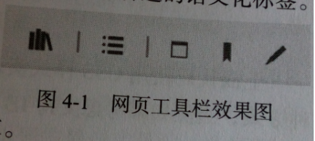
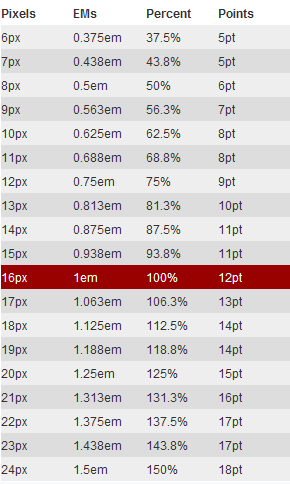

## 《Web前端开发最佳实践》
谨以此来解决开发过程中的疑惑，并且来规范代码。首先是要熟悉HTML、CSS、JS 等技术
### 一、概述
1、网页端的开发需要考虑网站的性能、浏览器兼容以及网络安全性方面的问题。从职责上来说，从前端UI到和后端的数据交互都属于前端开发的范畴。
2、掌握的技能： HTML CSS 前端编程 跨平台和浏览器 前端框架 调试工具 沟通能力。
3、规范的Web前端代码：更易维护、更高性能和更安全。
 <!--more-->

### 二、高效的web前端开发
1、结构组织和文件的命名。
2、前端代码重构：
     1）删除无用的代码，精简代码。主要是css和js，包括那些已经不起作用的CSS样式和废弃的js函数。
     2）前端代码规范化。css独立，调整代码的层次缩进格式；更改标准已经不推荐使用的标签，比如`<center> <b>` 改为由CSS样式控制；统一命名规范，主要是HTML中的id和class;在js中集中定义局部变量，并要把全局变量变成局部变量，缩小变量的作用域。
     3）统一基础类库，因为可能不同的类库实现的时候是用不同的功能。
     4）前端代码模块化。按照模块归类CSS代码，放到模块对应的独立CSS文件中；按照模块分离js代码，按照模块定义不同的命名空间。将js中公共的方法归类到独立的通用的文件中。
     5）提高页面加载性能。将不影响首页展示的js文件延迟到页面加载后加载；删除页面中初始隐藏的区域，改为通过js按需动态生成。
3、合理地使用前端框架
4、多浏览器的测试：多测试 早测试
5、Web前端代码开发和调试
	 集成开发环境 调试工具 性能分析 代码和资源的压缩和合并。
     在网站发布时，一般会压缩HTML、CSS、JavaScript代码及用到的资源文件（主要是图片），目的是加快文件在网络中的传输，让网页以最快的方式展现。
               方法: Web服务器开启Gzip压缩； js代码压缩； CSS代码压缩；HTML压缩； 图片压缩
6、前端代码基本命名规范和格式规范
     1）HTML命名规范以及规范
标签名和属性应该均为小写，属性值使用双引号闭合。

    //不推荐使用示例：标签名称大写，或者大小写混写；属性值没有用双引号闭合
    
    //推荐示例
    

给所有的关键元素定义元素的id和class，便于和CSS、JS交互。推荐的命名做法是根据语义和DOM树的层级关来定义名称，名称全部小写，id名称中的关键词用下划线（_）连接，class的关键词用中划线（-）连接。
     2）CSS命名规范就格式规范
         中划线连接，为了避免命名重复，命名时取父元素的class名作为前缀。eg:
         
         .reader-content-body {
               color: #fff;
          }
样式声明的顺序按照字母顺序排列。（尽可能的）
 相同的模块的样式定义在一起，不同的模块的定义之间用一个空行定义。
 注释放在选择器的上一行
    3）js命名规范及格式规范
  js局部变量命名采用首字母小写，其他单词首字母大写的方式。
          
          //不推荐示例,变量名首字母大写
          var ReaderBookmark = 'bookmark';
          //不推荐示例，变量命名以类型作为前缀
          var strName = 'Note'；
          //不推荐示例，变量命名使用语义不明确的缩写
          var newNT = function() {
          }
          //推荐示例
          var bookmarkDefaultTitle = 'untitled Bookmark';
  现在流行js的面向对象编程，那么就会有公有或者私有接口的概念，原则上公有接口的命名为首字母大写，私有接口的命名为首字母小写。
          给JQuery类型变量添加 $ 作为前缀。
          左大括号在行的结束位置。
          js 单引号或者双引号。单引号好一些，因为可以方便在字符串中包含有双引号的HTML代码。
### 三、HTML最佳实践
1、正确闭合HTML标签
2、停止使用不标准的标签和属性，简化代码。 `font big center` 等
3、不推荐在标签总添加样式属性，如`iframe  img input`等。
4、让HTML标签具有更好的语义。
5、 样式和结构分离
6、添加js禁用的提示信息
7、 添加必要的`<meta>` 标签：分为三类：
    （1）、那么属性和content属性组合，构成名称/值对。`<meta>`包括 `application-mame   author description generator` 等。其中keywords和description这两个名称使用率最高。（2）、http-equiv属性和content属性，指定特定的HTTP指令。（3）、charset属性，设置页面字符编码，4、自定义meta 类型主要是由互联网公司和浏览器厂商为实现特定的功能而定制的。但为了防止meta名称重复，所以先注册。已经有了一些常用的meta;1) 设置IE浏览器的兼容模式，http-equiv="X-UA-Compatible"。2)设置页面在移动设备中的显示。`<meta name="viewport" content="width=deveice-eidth, initial-scale-1,maximum-scale=1" />`   3)设置IE浏览器的“固定网站”功能。
### 四、高可读性的HTML
1、HTML语义化
就是在HTML代码中所使用的标签本身就可以说明标签包含内容的含义。优点：使得诸如搜索引擎以及第三方的内容抓取工具等更容易读懂页面代码；  提高了页面代码的可读性，有利于代码阅读者理解代码对应的模块。
######  实现效果如下图：



    //展示效果 如果有几个图标，并且前三个的中间用线条分割
    //初始设计
    <div id="reader_main_action" class="reader-main-action">
		<span class="reader-action-library"></span>
		<span class="reader-action-spliter"></span>
		<span class="reader-action-toc"></span>
		<span class="reader-action-spliter"></span>
		<span class="reader-action-note"></span>
		<span class="reader-action-bookmark"></span>
		<span class="reader-action-highlight"></span>
	</div>
并不推荐这么做，是因为使用的`<div><span>`并不具有任何语义，应该使用更有 语义的标签来代替

    //第二次设计
    <ul id="reader_main_action" class="reader-main-action">
		<li class="reader-action-library"></li>
		<li class="reader-action-spliter"></li>
		<li class="reader-action-toc"></li>
		<li class="reader-action-spliter"></li>
		<li class="reader-action-note"></li>
		<li class="reader-action-bookmark"></li>
		<li class="reader-action-highlight"></li>
	</ul>
这种方式比第一种方式更有改进，选用了语义化标签`ul`但是其中总共有5个操作项，但是却包含了7个`<li>`。两个分隔符和其他5个操作符具有等同的重要性，搜索引擎也会认为是7个。

    //第三次设计
    <ul id="reader_main_action" class="reader-main-action">
		<li class="reader-action-library"></li>
		<li class="reader-action-toc spliter"></li>
		<li class="reader-action-note spliter"></li>
		<li class="reader-action-bookmark"></li>
		<li class="reader-action-highlight"></li>
	</ul>
	//CSS
	.reader-main-action .spliter:after {
		content: '|';
		//其他
	}
这种方式使用CSS伪元素实现分隔符。把无关内容的元素彻底从HTML中分离出来。尽管这样已经很好了，搜索引擎也可以解析这段HTML，分析出这是具有5个操作项的工具栏，但是具体每个操作项的作用不得而知。所以进一步使用文字来说明

    //第四次设计
    <ul id="reader_main_action" class="reader-main-action">
		<li class="reader-action-library">library</li>
		<li class="reader-action-toc spliter">toc</li>
		<li class="reader-action-note spliter">note</li>
		<li class="reader-action-bookmark">bookmark</li>
		<li class="reader-action-highlight">highlight</li>
	</ul>
	//然而是不希望文字显示出来的，所以使用CSS隐藏
	.reader-main-action li {
		text-indent: -9999px;
	}
  这种方式给每个操作项添加了名称，现在语义更加清晰了。搜索引擎和第三方阅读工具可以识别元素中的文字来理解各操作项的作用。好了，下面总结原则：

1）熟悉所有规范中的HTML标签，理解各标签的语义，
          2）熟悉各标签上规范的属性，给HTML标签设置必要的属性。
          3）样式和结构的分离
2、如何设置网页标题层级
     1）页面内容的标题部分使用`<hx>`标签
     2）页面上只使用一个`<h1>`标签
     3）`<hx>`标签使用过程中不要跳级
3、正确的设计表单
     1）使用`label`标签，并设置for属性
     2）给输入控件设置合适的水印提示
     3)如果有必要，给输入控件设置tab顺序，tabindex = "2"
     4)使用HTML5中引入的表单控件
4、精简HTML代码
     1)精简HTML代码 有时候为了一个容器的作用，但完全是多余的。
     2)装饰性的元素使用CSS样式实现。
     3)避免使用table布局
5、过时的块状元素和行内元素
     在HTML4.01中， 常见的块状： `<div> <p> <table> <ul> <ol> <h1>~<h6>`
                                   常见的行内:  `<input> <a> <span>  <select>`
     块状元素独占一行 行内元素显示在行中
     在HTML5中，淡化这两种定义，并按照元素具体的语义重新划分了元US类型，分为7种：
          元数据式内容： `<base> <command> <link> <meta>`等
          流式内容： `<span> <div>` 等，这个里面包含了HTML4.01中的块状元素和行内元素。
          章节式内容： `<article> <aside> <nav> 以及 <section>`
          标题式内容： ` <h1>到<h6> <hgroup>`
          段落式内容：`<span> `等 基本上属于4.01中的行内元素
          嵌入式内容：`  <iframe> <svg> <audio> <video> <canvas>`等
          交互式内容： `<a> <button> <select> <input>`等
     另外： 在HTML5中，`<a> `已经是块状元素了。
### 五、积极拥抱HTML5
1、简化定义方式
	      1)定义文档类型声明： `<!DOCTYPE html>`
		  2)定义页面编码： `<meta charest="UTF-8">`
		  3)样式和脚本文件的引用：
2、使用HTML5中的新标签和新属性
          1）新标签： 语义化标签 功能性标签 输入控件类型
          2）HTML5中新增的标签属性：
               `<script>`标签中的async和defer是和脚本加载有关的。。
               defer是会以并行的方式下载脚本， 而不是阻塞的方式下载。 加载完毕之后，浏览器在DOMContentLoaded触发之前按照引用的顺序运行。。。
                async是HTML5规范中新定义的属性，目前IE9一下版本和Opera mini不可用。浏览器会异步下载js代码文件，并在下载完成之后立即执行。
                所以，defer会按照出现的顺序加载 而async不一定。
               `<base>` 中的 target属性
                标签上的自定义属性 `data-*`
3、处理浏览器兼容问题
          有一些浏览器会不支持HTML5中的新标签和新属性。所以可以通过documen.createElement 产生标签，再添加标签默认的样式。
### 六、高维护性的CSS
#### 1、如何高效的组织CSS代码
优点：合理地CSS代码组织结构可提高代码的重用性和可维护性，降低开发的复杂度。
1) CSS都可以分为两大类：通用类和业务类。有重置元素的默认样式；有共通模板的样式和一些基础样式；将兼容旧IE的CSS代码和正常代码分离，所以可以将一些兼容性的代码单独出来。
2) 样式声明的顺序：应该按照模块中元素的层级关系来处理，从父元素开始，同一级的就是从上到下，从左到右的定义对应的样式。
#### 2、使用CSS Reset：统一浏览器显示效果
曾经火爆一时的方案就是 `* {margin: 0; padding: 0;}` 弊端：需要重新设置回某些标签的padding和margin值，就比较麻烦。。。虽然此方案消除了浏览器差异，但是又增加了后续开发的复杂度，并不能很有效的提高整体开发效率。此外，这种方案的性能不佳，每当页面的元素很多额后似乎就回影响页面的渲染性能。
有几家公司退出了样式重置方案，但是作者还是推荐根据项目实际需求的样式重置方案。
比如:
```
address，
caption,
cite,
code,
em,
strong,
th,
var {
	font-style: normal;
	font-weight: normal;
}
h1,
h2,
h3,
h4,
h5,
h6 {
	font-size: 100%;
	font-weight: normal;
}
input,
textarea,
select {
	font-family: inherit;
	font-size: inherit;
	font-weight: inherit;
}
//其他样式：
li {
	list-style: none;
}
table {
	border-collapse: collapse;
	border-spacing: 0;
}
//大部分情况下 链接并没有设计为有下划线的形式，需要重置
a:link, a:visited {
	text-decoration: none;
}
```
#### 3、给CSS样式定义排序
主要是为了代码的可维护性和可读性考虑。
1）按照类型分组排序
	CSS属性分为7类： 显示与浮动；定位；尺寸；边框相关属性；字体样式；背景；其他
2）按照字母序排列（前面提过）
	按照属性的首字母排列，忽略浏览器前缀（如-webkit- ,-moz- ,-o- ,-ms-）
3）按照定义长度排序

最好和尽可能的使用工具如CSScomb，在实际应用中推荐使用第一种方法。
####  4、合理利用CSS的权重： 提高代码的重用性
首先熟悉一下选择器：
6种基础选择器： id选择器`#reader_title{}`，class选择器`.reader-title{}`， 属性选择器`a[href="##"]{}`，伪类和伪对象选择器`：hover{} ::after{}`，标签选择器`a{}`，通配选择器`body *{}`
三种组合选择器：后代选择器`.reader .title{}` 子选择器：`.reader>.title{}` 相邻选择器：`.reader+.title{}`

所以优先级： ID > 类|伪类|属性选择 > 标签|伪对象 > 通配
权重计算就是计算他们的值 相加。
如果有权重相同的，那么就采取“就近原则”来判断。
具体原则：
1）CSS样式中尽量不要使用ID选择器 。.
因为权重太高，导致很难覆盖，代码重用性低。
2）减少子选择器的层级。
因为对HTML结构依赖，还有样式代码整体的结构混乱。
3）使用组合的CSS类选择器。
因为不用考虑CSS样式覆盖的问题，避开了计算选择符权重的过程。同时也提高了代码的可重用性。
这个来自于 “多组合，少继承”。组合就是说把一个复杂的父类的可变部分和不变部分分离开来。
#### 5、CSS代码的兼容性：如何兼容IE浏览器
 自己看吧 ，这个我也不懂(http://browserhacks.com/#ie)
#### 6、em 、px、 还是%
W3C规定了两种尺寸单位：相对长度单位和绝对长度单位。
相对长度单位是相对于其他长度的，又分为字体相对单位`em ex ch rem`和视窗相对单位`vw vh vmin vmax`。  
绝对单位定义的长度是固定的，`px em 百分比%`     
px表示像素。相对长度单位。像素px是相对于显示器屏幕分辨率而言的。(引自CSS2.0手册)
em等同于`元素上`计算的字体大小值.`相对单位em是相对于元素本身的字体大小的。是相对长度单位。如当前对行内文本的字体尺寸未被人为设置，则相对于浏览器的默认字体尺寸。(引自CSS2.0手册)
在css中唯一例外的是font-size属性，它的em和ex值指的是相对父元素的字体大小。所以   1 ÷ 父元素的font-size × 需要转换的像素值 = em值`。百分比是相对于父元素尺寸来计算的。                                                                                                                                                                                                                   
所以：1）尽量设置相对尺寸
			2）只要在可预知元素尺寸的情况下才使用绝对尺寸
			3）使用em设置字体大小
#### 拓展：哈哈。这个是抄袭的。。
rem:rem是CSS3新增的一个相对单位（root em，根em），这个单位引起了广泛关注。这个单位与em有什么区别呢？区别在于使用rem为元素设定字体大小时，仍然是相对大小，但相对的只是HTML根元素。这个单位可谓集相对大小和绝对大小的优点于一身，通过它既可以做到只修改根元素就成比例地调整所有字体大小，又可以避免字体大小逐层复合的连锁反应。目前，除了IE8及更早版本外，所有浏览器均已支持rem。对于不支持它的浏览器，应对方法也很简单，就是多写一个绝对单位的声明。这些浏览器会忽略用rem设定的字体大小。

### 七、高性能的CSS
#### 1、使用高效的CSS选择器
简单来说，就是能被浏览器快速解析和匹配的CSS选择器就是高效的选择器。CSS选择器匹配过程是从左到右进行匹配的。
原则1）避免使用通配符，因为匹配了页面中所有的元素，匹配的计算量非常大。
	2）避免使用标签选择器及单个属性选择器作为关键选择器； 在选择符中，最右边的选择器为关键选择器，它决定着浏览器初始匹配的数量。如果使用标签选择器或者属性选择器，那么会让浏览器匹配命中更多的元素，计算量相对也会大点。
	3）不要在ID选择器前使用标签名；ID是唯一的，添加标签名是多余的，而且增加了匹配计算时间。
	4）尽量不要在选择符中定义过多的层级，最好不要超过三层；因为选择器的层级关系越深，那么顺着DOM查找匹配选择器的次数就越多。而且选择器层次少，则对应的CSS样式和页面的DOM结构耦合就会松一些。
#### 2、CSS相关的图片处理
1）不要设置图片的尺寸，因为存在性能问题，利用样式缩放图片会带来CPU的额外计算过程，增加了图片在浏览器中的渲染时间。而且超出实际尺寸的图片在网络传输中也会占用更多的带宽，增加了下载时间。
	2）使用CSS “雪碧”图技术
#### 3、减少CSS代码量
1）定义简洁的CSS规则：如下
2）合并相关CSS规则
CSS中的某些样式是有多个规则组合的，比如字体样式.。

    p.reader-title {
		font-family: Georgia, serif;
		font-size: 12px;
		font-style: italic;
		font-weight: bold;
		font-height: 30px;
	}
合并后

    p.reader-tutle {
		font: itelic bold 12px/30px Georgia, serif;
	}

类似的有`background、border 、margin 、padding 、text、list-style、 transform   、transition、animation`
3）定义简洁的属性值

    p.reader-title {
		color: #ff33ff;
		font-size: 0.8em;
		padding: 0em;
	}

简化后

    p.reader-title {
		color: #f3f;
		font-size: .8em;
		padding: 0;
	}

4)合并相同的定义
在CSS中，有些属性是可以继承的。如果某个父元素的多个子元素上设置了相同的可继承属性定义，则可以把相同的定义合并，且设置在父元素上。
5）删除无效的定义
这样会影响页面展示的性能，增加了浏览器对样式的解析时间。（一般就是手误写错的那些，哈哈）
#### 4、尽量避免使用@import和避免使用IE浏览器独有的样式：图片滤镜和CSS表达式。
因为这样会阻止页面的并行下载，就增加了样式文件的整体加载时间，从而带来性能问题。
### 八、CSS3相关最佳实践
1、查看浏览器的支持情况
2、添加必要的浏览器前缀
表示此定义只在特定的浏览器中起作用，Chrome和Safari浏览器使用-webkit- ,FireFox浏览器使用-moz- ，IE浏览器使用 -ms- ,Opera浏览器使用-o-。
1）使用工具来添加CSS属性定义的浏览器前缀
在线工具： Predixr
如果希望在开发中有更大的自主性，可以使用Autoprefixer。开发者可以自定义浏览器支持范围。
#### 扩展 --- CSS3 
这个是我左抄抄右抄抄，再加上自己的理解，属性很多，一点一点加吧。心情好多加点，心情不好就不加。人生已经如此的艰难。我要努力，为升职加薪为白富美而努力。
##### 1.border-radius
设置或检索对象使用圆角边框。提供2个参数，2个参数以“/”分隔，每个参数允许设置1~4个参数值，第1个参数表示水平半径，第2个参数表示垂直半径，如第2个参数省略，则默认等于第1个参数.

    //当水平半径等于垂直半径时，默认只有水平半径
    border-radius: 10px;
    border-radius：10px 20px;
    //当水平半径不等于垂直半径时
    border-radius: 10px 20px/5px 10px;
##### 2、border-top-left-radius
设置或检索对象的左上角圆角边框。提供2个参数，2个参数以空格分隔，每个参数允许设置1个参数值，第1个参数表示水平半径，第2个参数表示垂直半径，如第2个参数省略，则默认等于第1个参数

    border-top-left-radius:5px 10px;
类似的还有border-top-right-radius,border-bottom-right-radius,border-bottom-left-radius
##### 3、box-shadow
语法：

    box-shadow: none | <shadow>[,<shadow>]*
    <shadow> = inser? && <length>{2,4} && <color>?
none: 无阴影
第一个参数设置对象的阴影水平偏移值，可以为负值
第二个参数设置对象的阴影垂直偏移值，可以为负值
如果提供了第三个长度值则用来设置对象的阴影模糊值，不允许为负值
如果提供了第四个长度值则用来设置对象的阴影外延值，可以为负值
<color> 设置对象的阴影的颜色
inset 设置对象的阴影类型为内阴影。为空时，则对象的阴影类型为外阴影。

	    //外阴影模糊外延效果
		box-shadow:5px 5px 5px 10px rgba(0,0,0,.6);
		//内阴影效果
		box-shadow:2px 2px 5px 1px rgba(0,0,0,.6) inset;
#### 4、border-image
	 border-image：<' border-image-source '> || <' border-image-slice '> [ / <' border-image-width '> | / <' border-image-width '>? / <' border-image-outset '> ]? || <' border-image-repeat '>
	 //取值
	 <' border-image-source '>：
	设置或检索对象的边框是否用图像定义样式或图像来源路径。
	<' border-image-slice '>：
	设置或检索对象的边框背景图的分割方式。
	<' border-image-width '>：
	设置或检索对象的边框厚度。
	<' border-image-outset '>：
	设置或检索对象的边框背景图的扩展。
	<' border-image-repeat '>：
	设置或检索对象的边框图像的平铺方式。
	//例如;
	.test {
	border: 10px solid gray;
	border-image: url(test.png) 10/10px;
	}
好多啊。这个是border的，还有background的等等。
##### 5、过渡transition
一个元素从一种样式到另一种样式添加某种效果。必须要规定两项内容：指定要添加效果的CSS属性和指定效果的持续时间。目前Chrome、FireFox、Opera、Safari都支持，除了IE10以外不支持。

    transition：简写属性，用于在一个属性中设置四个过渡属性。
    属性1: transition-property: 规定应用过渡的CSS属性的名称
    属性2: transition-duration：规定过渡效果所花费的时间，默认0
    属性3: transition-timing-function: 规定过渡效果的时间曲线，默认‘ease’
    属性4：transition-delay：规定过渡效果何时开始
举个栗子：
		
	//简写	
	div {
		transition: width 1s linear 2s;
		/* Safari */
		-webkit-transition:width 1s linear 2s;
	}
	//hover
	div:hover {
		width:200px;
	}
##### 6、渐变Gradients
CSS3定义了两种类型的渐变
1）线性渐变(Linear Gradients)- 向下、向上、向左、向右、对角方向.。（从上到下是默认）
2）径向渐变(Radial Gradients)-由它们的中心定义
### 九、JavaScript最佳实践
#### 1、养成良好的编程习惯(具体稍后在另一篇补上)，提高代码的可维护性
1）避免定义全局变量或函数 
定义了全局的变量和函数，会影响代码的可维护性。如果在其中一段代码中定义了全局的变量或函数，则这些全局的变量或者函数在另一端代码中将会是透明的，意味着将会覆盖或者操作这些变量或函数。
最简单的办法：把变量和方法封装在一个变量对象上，使其成为对象的属性。

    var myCurrentAction = {
		var length = 0;
		function action() {...}
		function init() {...}
	}

但是这种方法的弊端就是都要通过主对象来实现，增加了代码的重复度和编写的复杂度。
改进的方法：把全局变量包含在一个局部作用域中，例如放在一个匿名函数中

    (function(){
		var length = 0;
		function action() {...}
		function init() {...}
	})()
但是有时候模块之间需要交互，这时候需要return语句返回需要公开的接口。如：

    var myCurrentAction = (function(){
		var length = 0;
		function action() {...}
		function init() {...}
		return {
			init: init;
		}
	})
这种方式巧妙地做到了代码逻辑的封装，又公开了外部需要访问的接口，是代码模块化的最佳实践方式之一。还有一种方式就是确保在定义变量时使用var关键字，如果没有的话，倒不会报错，就是浏览器会把它解析为全局变量。
2）使用简化的编码方式
比如通常在后端语言中：

    var person= new Object();
    person.age = 25;
    person.name = 'wei';
但是Javascript提供了更为简洁的方式，通过JSON方式创建对象和数组：

    person = {age: 25, name: 'haha'};
    //创建数组
    list = {12,20,24};
3）使用比较运算符 === 而不是 ==
	===和!==会比较两个基础类型值是否相等，或者两个复杂对象是否指向同一地址。而==和!=则会进行比较值的类型转换，在把两个值的类型转换为相同的类型后才会进行比较运算。==和!=在比较时的类型转换规则复杂：如下;
	undefined和null 和自己比较、两者比较都为true。但是与其他类型比较时，结果为false。 原始类型（数值型、布尔型和字符类型）进行比较时，会先转换为数值类型再比较；对象和原始类型比较时，会先把对象转换为原始类型再比较。
4）避免使用 with
5）避免使用 eval
它会接受一个字符串参数，会把这个字符串内容作为代码执行，并返回执行结果。
使用eval会使得代码难以阅读，影响可维护性。而且不安全，可能会执行别人恶意传来的代码。
6）不要编写检测浏览器的代码
#### 2、使用更严格的编码格式

    "use strict"
#### 3、事件处理和业务逻辑分离
#### 4、配置数据和代码逻辑分离
#### 5、逻辑和结构样式分离
从Javascript代码逻辑中分离CSS样式，不要使用

    list[i].style.borderWidth = '1px';
    //或者
    list[i].style.cssText += 'border: 1px solid f00';
可以这样

    list[i].className += 'empty';
    //css样式
    .empty {
		border: 1px solid #f00;
	}
从JavaScript代码逻辑中分离HTML结构
#### 6、JavaScript模板的使用
#### 7、在JavaScript开发中应用MVC模式
#### 8、JavaScript模块化开发
#### 9、合理使用AJAX技术
1）明确AJAX技术的使用场景
前端会根据用户需求动态获取后端数据然后更新网页界面；期望通过不刷新页面而取得资源或页面；动态验证用户的输入
2）借助成熟的AJAX框架，但不要忘记原生的AJAX使用方法
3）在AJAX上操作过程中，做好与用户的交互
应用于异步以及操作过程中页面无刷新的特色，所以需要提供一个反馈。让用户知道究竟在做什么样的操作、操作的结果如何等，防止用户误操作。具体方式有：
在AJAX过程中禁用出发此操作的按钮； 添加蒙版；或者在代码中添加表示正在操作的标志位等，如加载动画。
在AJAX操作完之后，如果操作失败，则要稿纸用户并提示用户后续的操作。
AJAX操作需要添加一个超时的限制，如果在此限制的时间操作未完成，则提醒用户超时并终止AJAX操作。
4）使用JSON格式作为AJAX传输的数据格式
5）使用合适的方案，弥补AJAX技术带来的缺陷
### 十、高性能的JavaScript
#### 1、加快js文件的加载速度
除了随着页面的加载而加载js文件外，还可以按需加载。
#### 2、养成良好的编码习惯，提高代码的运行速度
1）少用for-in 循环 
因为这个循环提供了遍历对象属性的能力，但他的性能很差，应该尽量使用for循环代替。
2）谨慎使用eval
因为浏览器只会优化那些可以预测和稳定的代码，而传入eval的代码带有很大的不可确定性，浏览器会以最慢的方式运行。其实主要还是他 带来的可维护性和安全性
3）正确使用 数组
使用数组时应保持类型的单一，混合了多种类型应该使用对象。
4）正确的内存回收
很多开发者使用 delete关键字来删除属性让对应的对象销毁，对象“垃圾”回收。如

    var o = {r: '1'};
	delete o.r;
dshi Chrome浏览器的JavaScript解析引擎中并不能通过上面的方式释放内存。相反使用delete可能会影响引擎的性能优化。在Chrome浏览器，JavaScript引擎会检测热对象并进行性能优化。如果使用delete关键字改变了对象的结构，则优化会失效。
浏览器回收的是那些不再访问的对象，具体做法：
##### 尽量不使用全局变量，因为在页面的整个生命周期中不会被回收。
##### 确保解除已经不需要的事件监听，如移除DOM对象绑定的事件。
##### 不要在闭包中返回外部不需要的对象。
#### 3、使用高性能的变量或属性值读取方式
1、 由于在js中没有块作用域，最小的作用域就是函数。在一个函数内部定义的变量可以在函数内访问到，函数中也可以定义函数，这就是说 函数不仅可以访问自己内部定义的变量，还可以访问外部的函数以及全局定义的变量。多个函数嵌套定义时，就会形成作用域包含的关系，这种关系称之为`作用域链`。
当一个函数被调用时，它的作用域链就会被初始化，如果要访问一个变量，可能定义在从此函数开始的作用域起始的任何外部作用域上。
若函数在运行过程中遇到一个变量，就会判断从哪里去的数据值。在此过程中，会顺着作用域链查找此名称的表示服，从最近的作用域开始，如果找到就使用这个变量，如果没有找到就会进入外层的作用域链中，如此反复，直到找到，或者判断为定义为止。
如下是一个常见的访问外部作用域变量的示例

    function update() {
	    var imgs = document.getElementsByTagName("img");
	    for (var i=0,len=imgs.length; i<len;i++) {
		    imgs[i].title = docunment.title + "- image -" +i;
	    }
    }

在函数运行的过程中，要解析docunment变量，于是它先在函数局部查找，然后在外部作用域查找，直到在全局作用域中找到了document定义为止。这种变量定义的查找会影响代码运行的性能，一个变量在作用域上查找的层级越多就读取的速度越慢。所以函数中局部变量的访问是最快的，全局变量访问是最慢的。
有些浏览器针对变量的读取做了性能优化，使得访问外部作用域的变量并没有性能的损失，但并不是所有的浏览器都有这样的优化，所以为了提高变量的读取性能，最佳的实践是尽量减少变量访问时在作用域链上查找的层级，最好是将变量定义为本作用域的局部变量，尽量不要使用全局变量。如果需要频繁的访问一个外作用域的变量，最好的方式是使用一个局部变量保存外部变量，把多次的外部作用域变量访问变成一次。上面的代码改写如下：

	    function update() {
			var doc = doucument;
		    var imgs = document.getElementsByTagName("img");
		    for (var i=0,len=imgs.length; i<len;i++) {
			    imgs[i].title = doc.title + "- image -" +i;
		    }
	    }
这就避免了多次的跨作用域查询。	    
 另外一个和作用域相关的性能耗损是 with语句的使用，使用with表达式不仅会让代码的维护性变差，而且也会影响性能
 try-catch表达式的catch块中也会产生一个作用域，访问外部变量时也会有性能的影响。最好是将try-catch块中的处理交给一个函数，避免了在内部访问外部域的变量。
 2、对象的属性值读取也存在和变量读取时类似的性能问题，读取对象上的属性值会搜索对象的`原型链`。
 介绍一下`原型`：原型是JavaScript中的一个概念。在JavaScript中并没有类的概念，是在JavaScript中实现的一种特殊的继承机制，有别于传统的类继承机制。在JavaScript中，对象的构造函数中有一个名为 prototype的对象，称之为`原型对象`。原型对象上的属性和方法是共享给`实例对象`的。所以说实例对象的属性和方法可能是自身也可能是原型对象的。因为原型对象本身也可以是其他构造函数的实例对象，所以原型对象中的属相和方法也可能来自于其作为实例对象时对应的原型对象上。这就形成了一个由各原型对象组成的prototype的链条，称为`原型链`。
 查找对象上的属相或方法时，首先会查找自身是否存在此属性或方法，如果没有找到就会继续在原型链上查找，直到找到或者未找到返回undefined值为止。以下是一个示例：
 

    function Person(name) {
		this.name = name;
	}
	Person.prototype = {location : 'china'};
	var personA = new Person('name1');
	var personB = new Person('name2');
	alert(personA.location); //china
	alert(personB.location);//china
在原型链上检索的层级越多，性能越差，即使是读取在对象上直接定义的属性也比读取局部变量慢。因此，如果频繁取得某个对象的属性值，尤其是该属性来自于对象的原型对象上时，最佳的做法就是把属性值缓存在局部变量中，提高读取对象属性的性能。例如：

    for (var i = 0; i<numbers.length; i++) {
	    numbers[i] *=2;
    }
在循环中会反复读取numbers的length属性值，性能改进的方案是使用一个局部变量缓存，例如：

    for (var i = 0, len= numbers.length; i<len; i++) {
	    numbers[i] *=2;
    }
#### 4、高效的DOM操作
DOM操作优化的总体原则是 尽量减少DOM操作。
先来看看为什么会影响性能：在浏览器中，DOM实现和ECMAScript的实现是分离的。通过JavaScript代码调用DOM接口，相当于两个独立模块的交互。相比较在同一模块中的调用，这种跨模块的调用其性能是很高的。但DOM操作对性能影响最大的还是因为它 导致了浏览器的重绘和重排。
浏览器的渲染原理：从下载文档到渲染页面的过程中，浏览器会通过解析HTML文档来构建DOM树，解析CSS产生CSS规则树。JavaScript代码在解析过程中，肯定会修改生成的DOM树和CSS规则树。 在这个过程中，CSS会根据选择器匹配HTML元素。渲染树包括了每个元素的大小、边距等样式属性，渲染树中不包括隐藏元素一句head元素等不可见元素。最后浏览器根据元素的坐标和大小来计算每个元素的位置，并重制这个元素到页面上。重绘指的是 页面的某些部分要重新绘制，比如颜色或背景色，元素的位置和尺寸并没有改变；重排则是元素的位置或尺寸发生了变化，浏览器需要重新计算渲染树，导致渲染树的一部分或者全部发生改变。重排的代价会比重绘的代价高很多。
以下的这些DOM操作会导致重绘或重排：
1、增加、修改和删除可见DOM元素
2、页面初始化的渲染
3、移动DOM元素
4、修改CSS样式，改变DOM元素的尺寸
5、DOM元素内容改变，使得尺寸被撑大
6、浏览器窗口尺寸改变。
7、浏览器窗口滚动
虽然重绘和重排是不可避免的，但是可以遵循一些最佳实践来降低他们带来的影响。
##### 1、合并多次的DOM操作为单次的DOM操作

    element.style.borderColor = '#f00';
    element.style.borderStyle = 'solid';
    element.style.borderWidth = '1px';
  可以改为：
  

    //方案1
	 element.style.cssText= '1px solid #f00';
	 //方案2
	 element.className += 'empty';
方案2比1性能上会有所损耗，因为需要查询CSS类，但是维护性好。
##### 2、把DOM元素离线或隐藏后修改
把DOM元素从页面流中脱离或隐藏，这样处理后，只会在DOM元素脱离和添加时，或者是隐藏和显示时才会造成页面的重绘和重排，对脱了页面布局流的DOM操作就不会导致页面的性能问题。这种方式适合那些需要大批量修改DOM元素的情况，具体：
1）使用文档片段
文档片段是一个轻量级的document对象，并不会和特定的页面关联。这种方式是创建一个文档片段，在此进行DOM操作，操作完后将它附加在页面上。

    var fragment = document.createDocumentFragment();
    //大量操作
    ...
    document.getElementById('myElement').appendChild*(fragment);
  2）通过设置DOM元素的display样式为none来隐藏元素
  这种方式是通过隐藏达到移除元素的效果，经过大量的DOM操作后恢复元素原来的display样式。
  3）克隆DOM元素到内存中
  在内存中操作完成后使用此克隆元素替换页面中原来的DOM元素，这就只剩下替换元素这一步的性能影响了。
  

    var old = document.getElementById('myElement');
    var clone = old.cloneNode(true);
    //一些基于clone的DOM操作
    ...
    old.parentNode.raplaceChild(clone,old);
##### 3、设置具有动画效果的DOM元素的position属性为fixed或absolute
设置为绝对定位使得元素脱离页面布局流，从而避免了页面频繁重排，只涉及到动画元素自身的重排了。这可以提高动画效果的展示性能。如果绝对定位不符合设计要求，则在动画开始时设置为绝对定位，等动画结束后恢复原始的定位设置。
##### 4、谨慎取得DOM元素的布局信息
 获取DOM的布局信息会有性能的损耗，如果存在重复调用，则把这些值缓存在局部变量中。
 另外获取DOM元素的布局信息会强制浏览器刷新渲染树，并且可能导致页面的重绘或重排。
##### 5、使用事件托管方式绑定事件
在DOM元素上绑定事件会影响页面的性能，一方面会占用处理时间，另一方面浏览器保存事件绑定，会占内存。
优雅的方式是 使用事件托管方式，即利用事件冒泡机制，只在父元素上绑定事件处理，用于处理所有子元素的事件。在事件处理中根据传入的参数来判断事件源元素，然后做不同的处理。
#### 5、使用辅助工具优化JavaScript代码性能

  
