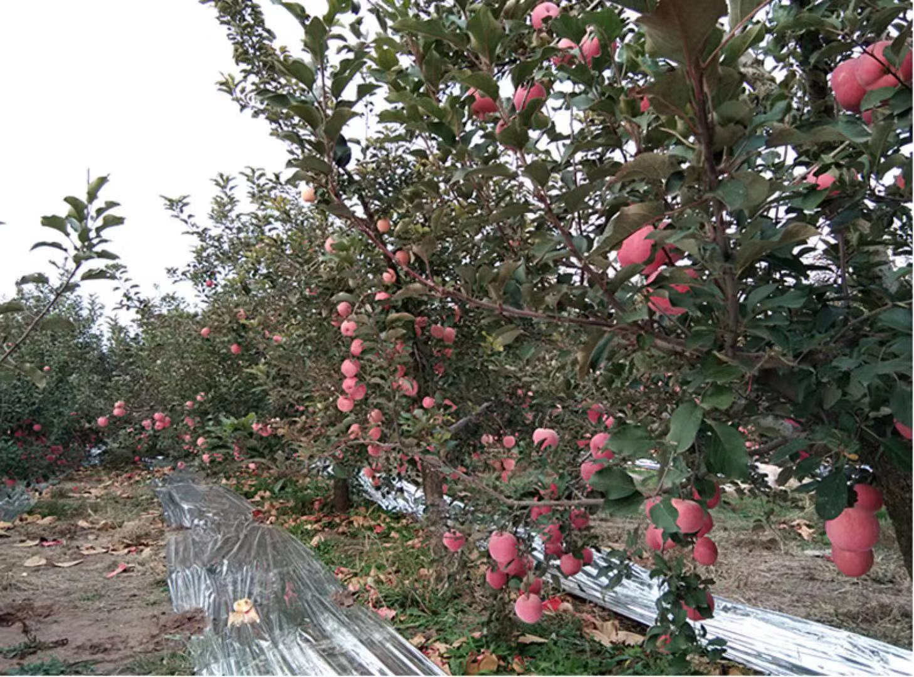
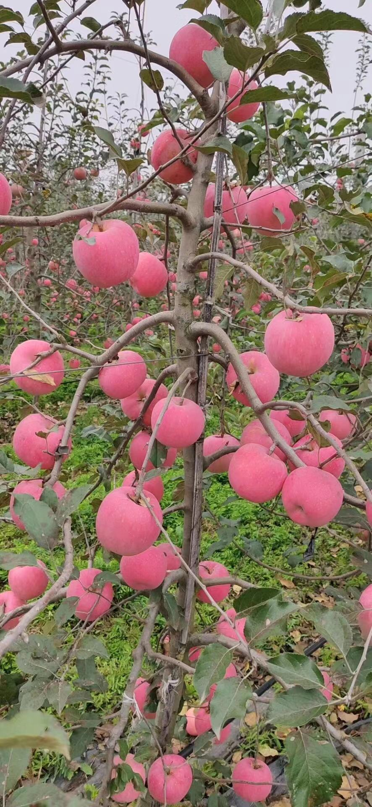
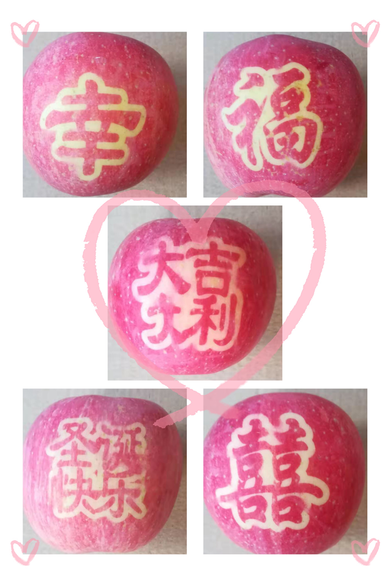

一年的栽培与等待只为将红苹果送到您的手中~
 <!--more-->
我的家乡——千阳县三合村是苹果优生区，因地区光照充足昼夜温差大，生长的苹果色泽光亮，食用脆甜可口。并荣获国际乐川苹果节金项奖、荣登陕西省优质水果金榜、曾两次连续获得农博会“后稷金像奖”，被国家农业部认定为“一村一品”示范村。
<!-- 
 -->

我家的苹果都是父母精心种植，在成长过程中使用专用纸袋保护，不沾一滴农药，不打蜡，纯天然自然上色。多吃苹果美容养颜、降低胆固醇和血压，对身体大有益处。

最后，感谢您的信任。如您有反馈的问题或下单订购，请扫下面二维码

