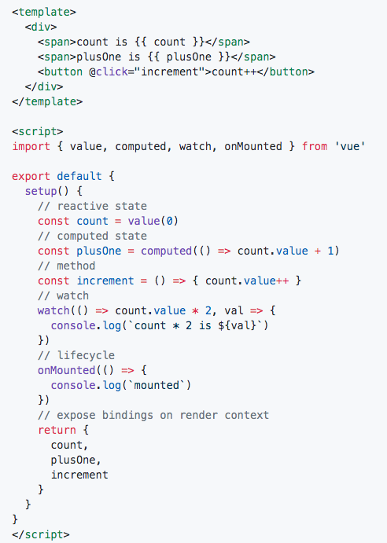

## 与Vue3相关的主题演讲-尤雨溪
#### 演讲PPT与视屏 【https://www.yuque.com/vueconf/2019/gwn1z0】

### 发展现状
Chrome DevTools有约90万的周活用户，React有160万。Evan认为Chrome DevTools可以反映Vue项目的真实开发者数据。GitHub stats第三名，实际代码项目第一名。Vue有全球化的影响力，有许多线下活动；State of JavaScript 2018调查中是前端框架满意度第一，StackOverflow 2019 年度调查第二；使用的公司遍布全球。
### vue3.0 设计目标
 >更小
 >更快
 >加强TypeScript支持
 >加强API设计一致性
 >提供自身可维护性
 >开发更多的底层功能

#### 更快
##### 1：数据变动的侦测变为Proxy。
```
var proxy = new Proxy(target, handler);
```

对目标对象架设一层拦截，可以重定义属性的 get 和 set 行为。消除了 Vue2.1 中的许多限制：无法监听属性的监听和删除、数组索引和长度的变化，并支持 Map ,  Set , WeakMap ,  WeakSet 。

因为defineProperty 在转化对象属性的时候是一个昂贵的操作，js引擎更倾向于一个稳定的数据结构，如果变来变去，可优化性变低。
proxy初始性能好，不需要对原始对象做太多的改动，效率更高。
    *但是IE11不能支持*
##### 2：virtual dom重构
用```TypeScript```重写，比如组件的启动速度比2.5版本快了一倍。引入编译时的优化，比如slot默认编译为函数。生成VNode函数,参数一致化。编译时，给每一个vnode带上类型、children类型的信息，帮助runtime更快。

##### 3：更多的编译优化： vnode有自己的标识。
virtual dom 不是为了更快，而是使用JavaScript描述当前页面。
virtual dom核心价值在于表达力。每一次更新，virtual dom需要重新创建一遍，进行新树旧树遍历比对。在组件树的层面最小化了需要更新的点，但是组件粒度相对还是粗。
**传统dom的性能跟模板大小成正相关。**

其他优化点：比如在 p 标签中，已知 class 是动态绑定。对class也会有 parse 处理,就不会再去对比两个p，而是将class设置上去即可。
速度优化：2.6.10（36ms），3.0（5.44ms）约 6 倍的速度增长

###### 传统dom的性能瓶颈
每次遍历很慢。jsx和render function是完全动态的。所以不能通过模板内容推测一些信息,用于优化的信息不足。
 react对于jsx这种动态的策略是时间分片，把cpu时间切分到一帧一帧,从而不会阻塞用户的操作。但是如果vue更新足够快，就不要时间分片。
 比如SVELTE-极致编译，底层没有vm，和vue模板很相似。动态更新性能很强，代价：给予表达渲染结果有很大限制，只能用模板，模板编译完直接变成命令式的代码，放弃jxs和render function带来的灵活性。


 ###### 为什么不抛弃 Virtual Dom
 手写render function获得更强的表达力:比如路由库、组件库、逻辑是使用render function实现，比模板更方便。
 兼容2.x
vue所特有的：底层是Virtual Dom，上层有包含大量静态信息的模板。
所需要做的：兼容手写的render functuon，最大化的利用模板静态信息。

#### 动静结合
由于模板的更新性能与模板大小正先关，与动态节点数量无关。导致很多遍历都是性能的消耗。

先把模板看成静态的，然后去分析哪些会动。Virtual Dom 两个children数的比对，没必要了。
节点结构的变化：这种动态节点只在v-if v-for出现。
所以以结构性指令为边界，将整个静态模板切分为一个一个的静态块，称为 ```Block tree``` 。每个区块用一个array去追踪自己内部的动态内容。就是说，极大限度的减少无谓的遍历。
**新策略将vdom更新性能提升为与动态内容的数量相关。**

#### 撤销Class API
原本目的是更好的TS支持：但是Props和其他需要注入到this的属性导致类型声明依然有问题；Class这种概念，想到的会是OOP，继承这样的逻辑。但是在写UI组件的时候，通常不会用到，更多地会是组合。所以除了类型支持之外Class API并不带来任何新的优势。
#### 取代Class API - Function-based API 

新的函数API.
value传进一个值，包含数字0，其实一个包装对象。取值用 count.value取。如果是字符串、也可以在函数穿来穿去。.value还会被追踪依赖，所以会更新。计算属性还是会返回值的包装。方法就很简单了。watch里面计算一个表达式的值。暴露什么东西给渲染上下文，和data意义一样。
**好处**：
1：更好的TS类型推到与支持：ts对函数参数、返回值支持度很好。如果vue中神明的类型、返回的类型已经写好了，所以很好识别。

**Basic example**


2：灵活复用：例子：鼠标位置侦听。
    （1）在Vue2.0的时候，使用Mixins实现。但是问题是：命名空间冲突、数据来源不清晰。
    （2）Higher Components实现。Mixins问题仍然存在，并且有额外的组件实例性能消耗。
    （3）Renderless Components 作用域插槽。解决了Mixins的问题，但是仍然会有额外的组件实例性能消耗。
    （4）With new API
    

3：tree-shaking友好：因为这些方法是从全局vue中import进来的。 ``` import {value,method,computed} from Vue```。 如果这些API没用到，则tree-shaking更少了，bundle更小。vue本身的尺寸实际上是动态的，用到的vue东西越少，包越小。


4：代码更容易压缩
一般、这些变量、函数名是可以被压缩成一个字母的，但是对象，属性不能被压缩。大部分情况下压缩这些属性是不安全的。所以function-api对压缩更友好。


