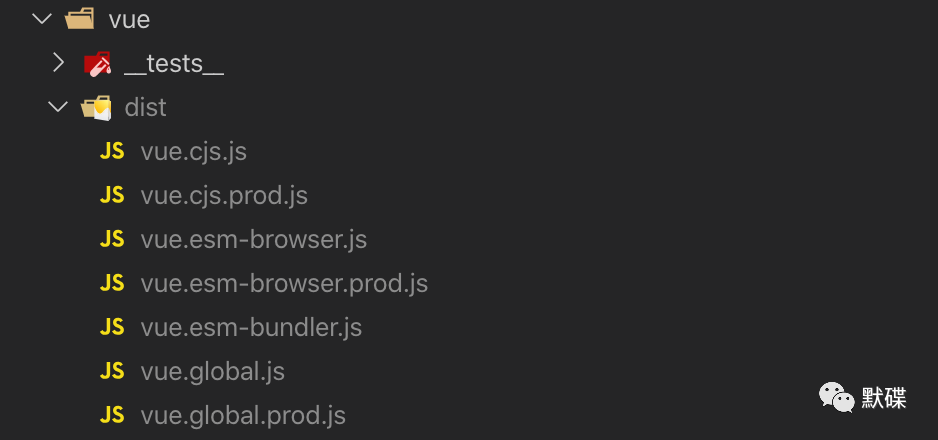
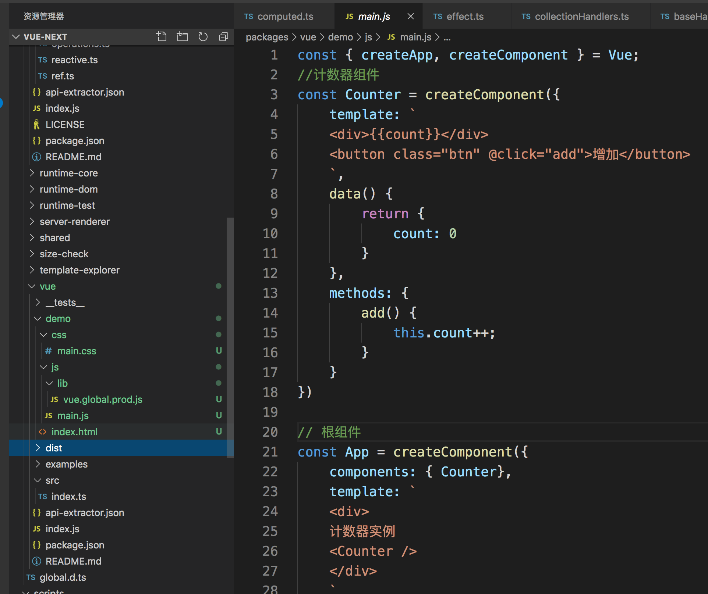

#### 源码熟悉
下载[vue-next](https://github.com/vuejs/vue-next/)仓库地址

> vue Vue项目的主入口模块
> reactivity 实现vue3.0的数据响应式功能的核心，发现是computed相关的数据处理很多
> compiler-core 模板核心语法编译器，对标签、属性、指令（如v-if、v-for、v-bind、v-model、v-on、v-once等）的语法编译
> compiler-dom vue模板编译器，编译模板中其他功能性指令（如v-html、v-text等），依赖于compiler-core
> runtime-core 实现虚拟dom、组件定义、生命周日、指令定义、依赖注入、渲染等功能的核心模块
> runtime-dom vue在浏览器dom环境运行时，负责实现与浏览器环境运行所需的相关特性

#### 编译-得到vue3.0的运行环境
```
npm install
npm run build
```
在vue目录下会生成一个dist文件夹

我们会用到的是dist目录下的vue.global.prod.js这个文件，这个是打包后得到的最完整的框架代码，可以使用script标签直接饮用。

#### 上手写demo
建一个文件夹，下面的文件结构如下图所示，有css和js目录，分别存放示例代码要用到的样式、vue的js库文件、以及我们编写的示例js代码文件；而 index.html 则就是这个程序的主入口了。


#### 使用COmposition API

为了向下兼容，对vue2.x的写法几乎都支持，这种写法被称为Options API(可选项式Api),就是说在创建组件的时候，其实都是在拼装一个可选项集合，比如我们传入data\computed\methods等。
这种方式虽然清晰，但是这个写法在逻辑复用上并不友好，在js里，最简洁最清晰的写法是封装为一个个单纯的函数，然后函数与函数之间的调用。所以之前的写法在复用性和优雅度上不大好，对比函数组成的模块，使用时通过具名方式导入，则在使用tree-shaking的是时候支持的更好，有更好的效果。以下是一个具名方式导入的例子，要养成好习惯
```
    import {myFUn1} from 'my-module;'
```
vue3.0支持TS,TS一个很重要的特性就是类型推导，而函数对类型推导也不友好。

因此，像Composition这种函数的编程风格，成为了新框架的亮点。
```setup```方法，它是Vue3.0中新增的组件入口，专为使用Composition API而设计，调用时机是在组件生命周期的 beforeCreate 和 created 之间（所以在 setup 里面是访问不了你所期望的 this 对象的，即它里面的this并不是指向当前组件，这点需要注意也尽量避免使用）

data里面的响应式对象属性是使用```ref```函数创建的响应式常量。

将一个x值操作的逻辑部分抽离到函数，然后进一步把这些独立逻辑函数移入到模块文件中。

##### ref reactive render props 生命周期 加油