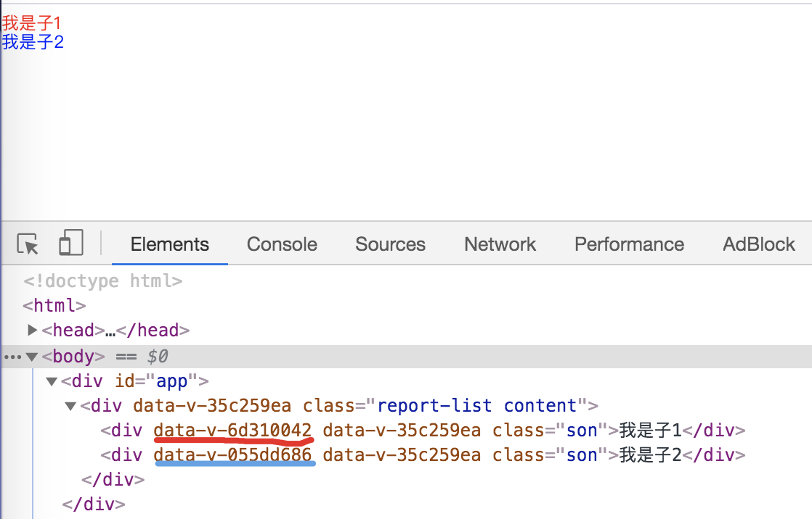
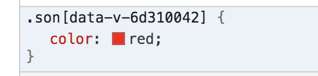
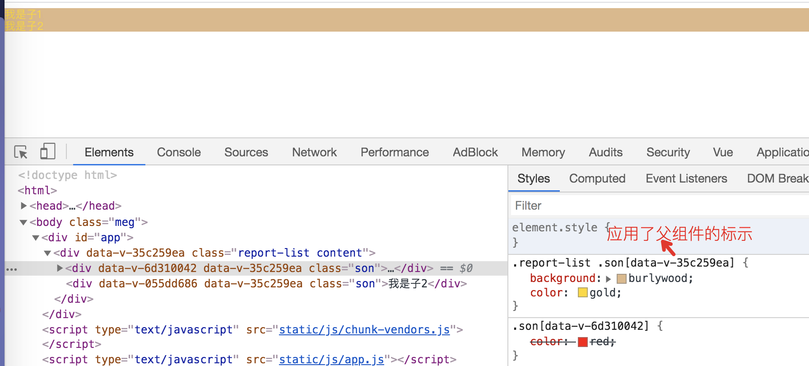
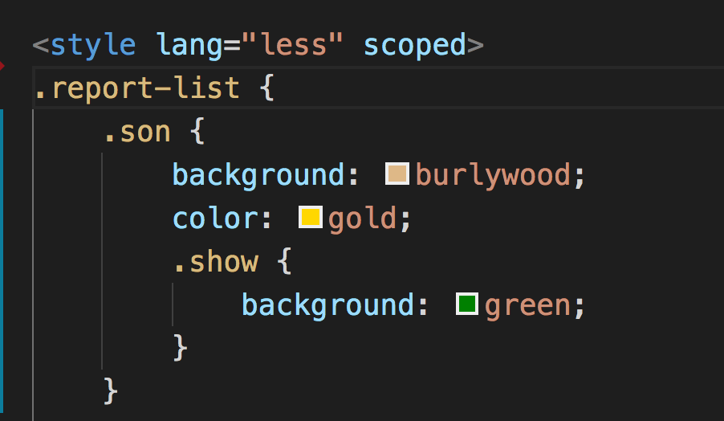
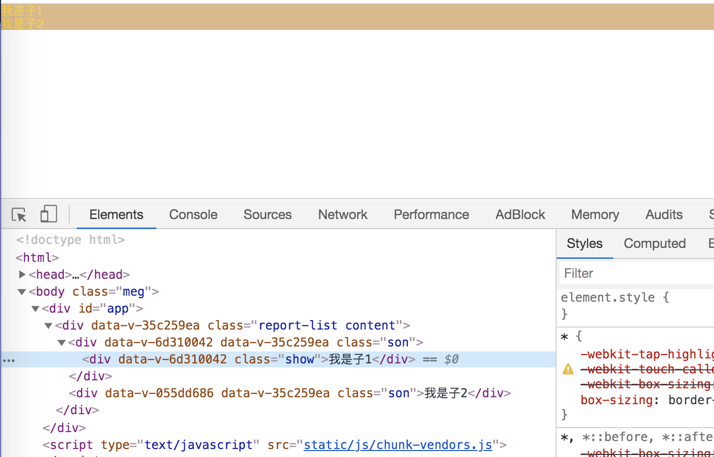
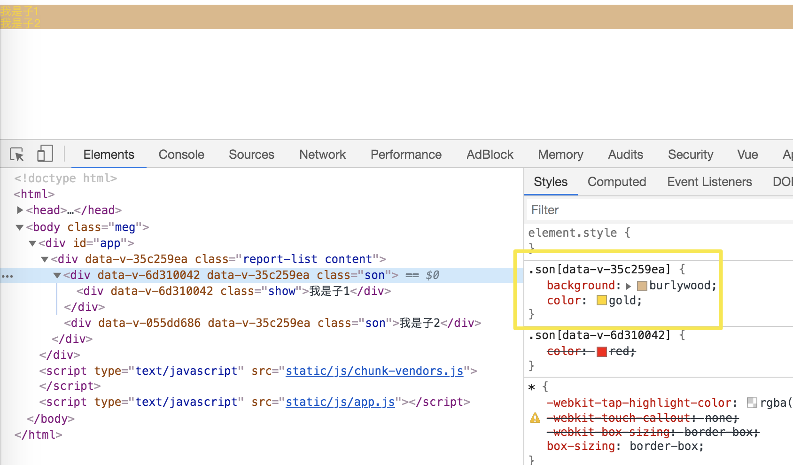
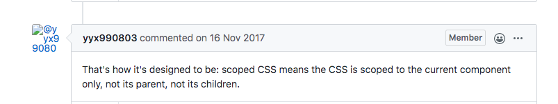

### 作用功能
实现组件内部样式私有化，不对全局样式造成污染。

### 实现原理
观察dom结构发现，vue在dom结构和css样式上加上字符```data-v-xx```标识来保证唯一，达到样式私有化。
如以下实例，父与两个孩子均加了scoped作用域。则每个div绑定了唯一的标示。





发现应用的是父组件的标示，没有作用到想要的dom节点上。

这样的话，如果在```.report-list```内部定义```.son```下的```.show```，是不起作用的。


解决方式：
添加全局衡阳市。或者再写一个不带```scoped```的```style```标签。


但是这种情况下，如果在父组件中定义了子组件，子组件内部不会被添加父组件的标示，只添加子组件本身的标示。

### 尤大大的官方解释
scoped设计的初衷就是不能让当前组件的样式修改其他任何地方的样式。

