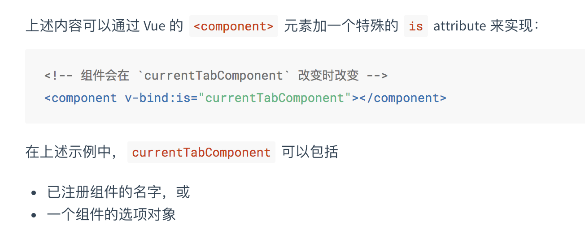

#### Vue.nextTick()的作用
在下次DOM更新循环结束之后 执行 延迟回调。在修改完数据之后调用获取更新后的DOM。
#### 使用Vue.nextTick()的情况：
1：在Vue生命周期的created钩子函数进行的DOM操作一定要放到Vue.nextTick()的回调中。相对应的在mounted中执行任何DOM操作都不会有问题。
2：在数据变化后等待Vue完成更新DOM，可以在数据变化之后立即调用。
3：mounted不会承诺所有的子组件也都一起被挂载。如果希望等到整个视图都渲染完毕，可以在mounted钩子里面调用nextTick()。

#### CSRF漏洞

#### Vue父组件通过props向子组件传递方法

#### 组件继承与扩展

##### slot
##### Mixins
##### extends 
接受的参数是简单的选项对象或构造函数，所以extends只能单次扩展一个组件。

相对于Mixins，extends触发的优先级更高。
##### extend
创建一个构造器，为了创建可复用的组件。主要是服务于Vue.component

#### 
#### vue组件间通信的六种方式

##### 一： props/$emit

##### 二： $emit/$on
通过空的vue实例作为事件中心，用它来触发事件和监听事件，巧妙而轻量的实现了任何组件之间的通信，包括父子、兄弟、跨级。
```
    var Event=new Vue();
    Event.$emit(事件名,数据);
    Event.$on(事件名,data => {});
```
##### 三：vuex

##### 四：$attrs/$listeners
多及组件嵌套需要传递数据的时候，而不做中间处理。Vue2.4提供了这个方法。

$attrs包含了父级作用域中不被props所识别所获取的特性绑定；
$listeners包含了父作用域中不含.native修饰器的v-on事件监听器。
##### 五：provide/inject
允许一个祖先组件向其所有子孙后代注入一个依赖：祖先通过provider提供变量，子孙组件通过inject注入变量。主要解决了跨级组件间的通信问题。
provide方法，返回一个对象。inject是一个对象，使用的时候injections.theme.color
*需要注意的是：绑定并不是响应的。*

###### 实现数据响应
（1）：祖先组件的实例在子孙组件中注入依赖。
（2）：2.6提供API：Vue.observable

##### 六：$parent/$children 访问父/子实例. ref指向DOM元素和组件实例。


##### 页面回流
当页面尺寸、布局、隐藏等改变而需要重新构建。
当元素的外观，称为重绘

#### Vuex 的 dispath 和 commit

> 1：dispath对应action，处理异步请求
> 2：commit对应mutation，所有的修改都需要通过mutation
> 3:那什么时候知道action执行完毕呢？

#### JSON.parse(JSON.stringify(obj))的缺点

1. 如果是时间对象，拷贝完之后变为字符串形式
2. 如果有RegExp、Error对象，则序列化的结果是空对象 {}
3. 如果有函数、undefined，则序列化的结果会把它们丢失
4. 如果有NaN、Inifinity、-Inifinity，则序列化的结果会变成null
5. 只能序列化对象的可枚举的自有属性，拷贝之后会丢失对象的constructor，变为Object
6. 循环引用下也不能正常拷贝
   
#### Content-Type

表示请求和响应中的媒体类型信息。用来告诉服务器如果处理请求的数据，和搞死客户端如何解析响应的数据。
比如text/html、text/gif等等。以下几种比较特殊，需谨记在心

1. application/x-www-form-urlencoded
    http会将参数使用key1=val1&key2=val2进行组装，特殊字符会转码。不支持文件。
2. multipart/form-data
    多部分多媒体类型。多个参数就有多个boundary块。支持文件上传。
3. apllication/json
   轻量级数据格式，以"键值"对组装数据。

#### 动态组件

初始化只挂载了组件A，每次切换都会重新触发组件的生命周期，切换时并没有保留之前的状态（组件A的选中），但是在在某些情况下，我们更希望那些标签的组件实例能够被在它们第一次被创建的时候缓存下来。
所以可以使用```<keep-alive> ```
 ##### vue 动态组件传参
 可以通过prop做，动态判断

 ##### 记一次vuex的mapGetters无效原因
 mapstate  获取时，在浏览器中显示error during evaluation

解决：因为在new Vue的时候，没有将store注入进来，导致vuex里的代码this.$store获取不到。
结论：就是如果用到这些辅助函数，一定要保证new Vue的时候注入store。

我的解决方式是加上模块名【大写】


#### vue-router 冒号 问号
Modified Parameters
Optional
Parameters can be suffixed with a question mark (?) to make the parameter optional. This will also make the prefix optional.
```
var re = pathToRegexp('/:foo/:bar?', keys)
// keys = [{ name: 'foo', ... }, { name: 'bar', delimiter: '/', optional: true, repeat: false }]

re.exec('/test')
//=> ['/test', 'test', undefined]

re.exec('/test/route')
//=> ['/test', 'test', 'route']

```

#### keep-alive使用注意事项
```<keep-alive>``` 是用在其一个直属的子组件被开关的情形，即要求同时只有一个子元素被渲染