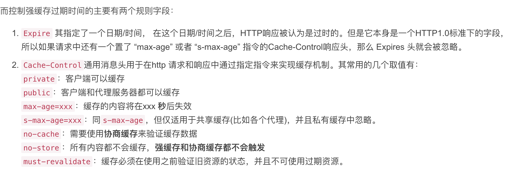
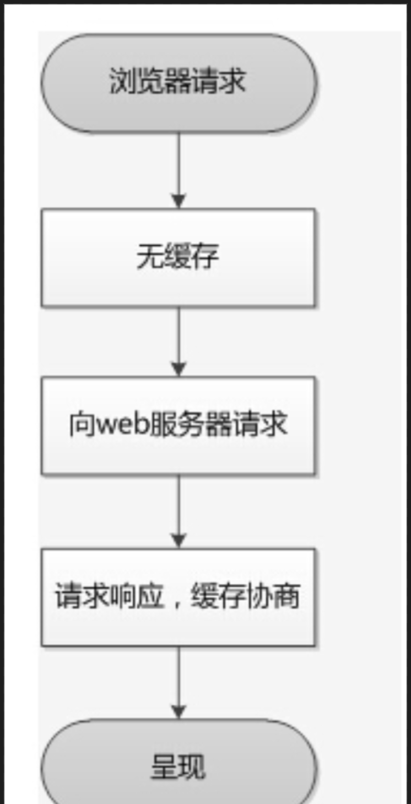
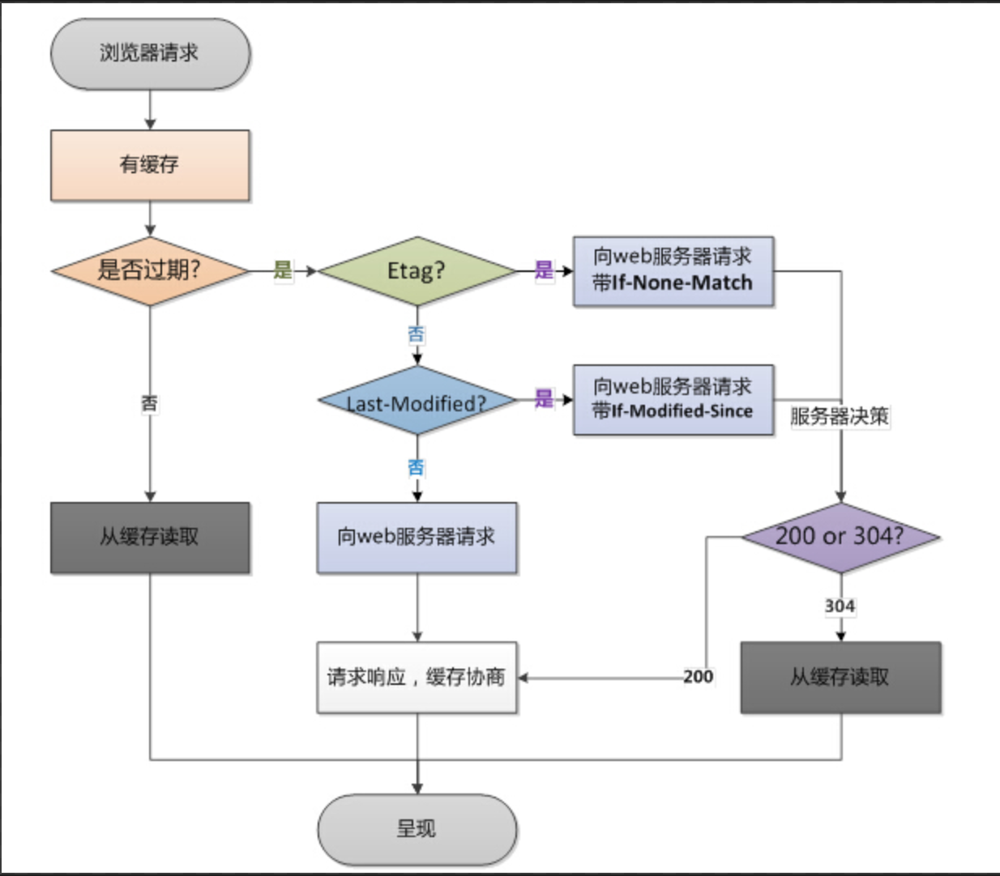

[前端错误监控指南](https://juejin.im/post/5e94001bf265da47f07939b1)
推荐工具：
1. 前端日志上报与JS异常监控 - badjs-report；[github](https://github.com/BetterJS/badjs-report)
2. 后端接口问题用kibana查询，前端报错使用[sentry](http://sinhub.cn/2019/07/getting-started-guide-of-sentry/)。

WebSockect是一种标准协议。
对比以往，客户端跟服务端双向数据通信时，客户端需轮询或者发出请求后一直等待服务端返回，这样很占用资源。
如果你有这些需求可以考虑使用 WebSocket：
1、多个用户之间进行交互；
2、需要频繁地向服务端请求更新数据。
比如弹幕、消息订阅、多玩家游戏、协同编辑、股票基金实时报价、视频会议、在线教育等需要高实时的场景。
 
<!--more-->

### 原型
原型：对象有一个__proto__，是一个指向原型的指针。
构造函数声明的时候就创建了原型对象，然后挂载到构造函数的```prototype```属性上。
原型对象创建的时候，会生成constructor属性，指向它的构造函数。
https://juejin.im/post/5eb52ad9e51d454de64e4306


### HTTP 缓存
缓存分为HTTP缓存和浏览器缓存（cookie localStorage sessionStorage）
HTTP缓存分为强缓存和协商缓存，只能缓存get请求响应的资源。
**强缓存**
强缓存就是给资源设置个过期时间。不与服务器进行通信，直接使用本地缓存。
相关头部字段控制：Expires / Cache-Control / Progma  no-cache

强缓存的优先级：Pragma  > Cache-Control  > Expires

**协商缓存**
协商缓存就是需要客户端和服务器两端进行交互的
// response header
etag: '5c20abbd-e2e8'
last-modified: Mon, 24 Dec 2018 09:49:49 GMT

// request header 变为
if-none-matched: '5c20abbd-e2e8'
if-modified-since: Mon, 24 Dec 2018 09:49:49 GMT

**ETag 和 If-None-Match**
当第一次请求，服务器响应200，并返回```ETag```(该值存放服务器端生成的序列key)。
第二次请求时客户端发送```if-none-match```（即刚才的key），用来询问资源有没有修改。
浏览器第一次请求资源

**Last Modified 和 If-Modified-Since**
当第一次请求，服务器响应200，并返回```Last Modified```(表示文件在服务器端最后被修改的时间，精确到秒)。
第二次请求时客户端会在请求头添加```If-Modified-Since```标记，询问服务器该时间之后文件是否改动。

如果服务器端的资源没有变化，则自动返回304状态，使用浏览器缓存。


浏览器第二次请求资源


优点：
1. 减少不必要的数据传输，节省带宽
2. 减少服务器的负担，提升网站性能
3. 加快了加载网页的素服，用户体验度友好
缺点：
可能会由于更新不及时导致获取新资源失败。所以要保证不同资源的hash不同。
我的做法是：
index.html文件采用协商缓存；其他资源采用强缓存 + 协商缓存
[参考](https://www.jianshu.com/p/9c95db596df5)
#### 手写一波 promise 防抖节流 发布-订阅 call apply bind new 深拷贝
https://juejin.im/post/5eb8f5cdf265da7bd44254b4


#### 调研go在前端的应用
go 在 1.1版本加入了WebAssembly的体验支持。
需要编译go代码成wasm格式
https://www.e-learn.cn/topic/3589606


#### npm中 --save --save-dev -D -S的区别
--save == -S
--save-dev == -D
npm i --save-dev <packname> 工程开发、打包依赖。处于devDenpendencies
npm i --save <packname> 工程运行、发布到生成环境的依赖。处于dependencies
当设置NODE_DEV=production，仅仅会拉取dependencies中的依赖

#### Express
基于node.js的web开发框架


### [前端微服务](https://www.yuque.com/feluobutou/uwnb9d/daolun-weiqianduanyudaqianduan)


前端应用可以独立运行、独立开发、独立部署。以及，它们应该可以在共享组件的同时进行并行开发——这些组件可以通过 NPM 或者 Git Tag、Git Submodule 来管理

路由分发应用


#### 一些题外话
简历中比如说 "使用 axios 进行数据交互, 与后端进行数据协同" (废话, 你能用 axios 来渲染 UI ? 能的话我直播吃翔)
4.1 但如果能说 "XXX 项目中, 解决了 XXX 问题, 提出 AAA 方案 or 研发规范 等" 可加分


#### AMD COMMON

#### shadow dom
https://www.jianshu.com/p/e47b103f3b60


#### ES新特性


#### BFF

#### Webpack5

#### 复制粘贴功能
https://www.csdn.net/gather_26/OtDaYg1sNTAyLWJsb2cO0O0O.html
##### 从excel复制一行数据到页面实现粘贴-小技巧实现
需要准备一个全局隐藏input（z-index:-100）。
按下ctrl+v之后 =》父级元素捕获keydown事件 =》1：本身input失焦(不要将复制的内容粘贴到里面) 2：让隐藏域得到焦点，在setTimeout中失焦。 =》再去处理input触发blur事件(最好放到settimeout)，从隐藏input中获得数据，并做split处理。

#### origin和upstream的区别
开源库fork到自己的github / 自己的github上clone到本地
upstream和origin是并列关系。origin指的是所克隆的原始仓库的默认名字，upstream是fork的原项目的远程仓库的默认名字。

#### 火狐浏览器的onload
1. Firefix下iframe的onload事件无法触发
问题： 已经load的document,重新open再write一个iframe，则整个iframe的onload不会执行。
解决：
#### 浏览器的First Paint
先了解下浏览器加载页面的过程：
1. 在浏览器输入url，发送请求到服务器，服务器返回请求的HTML。
2. 浏览器下载完成HTML(Finish Loading HTML)之后，开始从上至下解析。
3. 解析过程中遇到css和js外链会执行以下过程
    1. Send Request 向服务器发送请求
    2. Receive Response 接受响应，告诉浏览器可以从网络接受数据了
    3. Receive Data 开始接受数据
    4. Finish Loading 表示已经完成下载数据
    5. Parse Stylesheet/Evaluate 默认情况下js执行完毕之后会evaluate，css下载完毕后会parse Stylesheet
4. 所有css下载完毕之后Parse Stylesheet，然后开始构建CSSDOM
5. DOM和CSSDOM合并生成一个渲染树（Render Tree）
6. 根据渲染树的内容计算各个节点在网页中的大小和位置（Layout）
7. 根据Layout绘制内容在浏览器上（Paint）

##### 在perfomance中可以看到加载的虚线
蓝色线条：DOMContentLoaded
绿色线条：first paint，首次渲染
红色线条：load事件，表示图片等资源全部下载完成

##### DOMContentLoaded和load的区别
前者是在HTML文档（包括js和css）被加载以及解析完成之后触发（HTML->DOM）
后者是在页面的其他资源（比如图片、字体、音频）加载完之后触发

##### 根据CSSDOM计算样式并进行布局绘制的过程
1. Recalculate Style 重新计算样式
2. Layout 根据计算的结果进行布局，确定元素的大小和位置 
3. Update Layer Tree 更新渲染层树
4. Paint 绘制，根据Layer Tree绘制页面（位置、大小、颜色、边框等）
5. composite Layers 形成层，按照合理顺序合并一个图层输出到屏幕。

#### 所以first paint的过程是
1. 所有css加载完成
2. Parse Stylesheet: 构建出CSSDOM
3. 接下来进行布局绘制。（同上述根据CSSDOM计算...）

##### FP出现的时机
在第一脚本之前的DOM和CSSDOM准备就绪之后，变会渲染第一脚本前的内容。
##### 建议：
1. css放到头部，js放到`</body>`之前
2. 减少head中css js大小，可以使用gzip
3. 在第一脚本前使用骨架图，减少用户的白屏感知时间


#### 为什么需要清除浮动
因为没有高度来撑起父盒子，父盒子会产生高度塌陷。
清除浮动：1-在父盒子最后clear: both；2-设置父元素overflow: hidden/auto;

### .babelrc文件
babel是一种语法编译器。babel6.X版本之后，所有插件可拔插，就是说只安装babel依然无法工作的，还需要配置对应的.babelrd文件才起作用。
 .babelrc文件需要的配置项主要有预设(presets)和插件(plugins)。
 参考- .babelrc文件需要的配置项主要有预设(presets)和插件(plugins)。

### babel
是一个转换器，将ES6转成ES5，将JSX转成js等。借助babel，开发者可以提前用上新的js特性。
实现转换的核心就是babel-plugin
preset可以看做是plugin的集合，

可以同时使用多个Plugin和Preset，此时，它们的执行顺序非常重要。

先执行完所有Plugin，再执行Preset。
多个Plugin，按照声明次序顺序执行。
多个Preset，按照声明次序逆序执行。

### RobotJS

Robotjs是nodejs的第一个用于桌面自动化的库，可以自动化鼠标、键盘和读取屏幕，并且有Mac, Windows, and Linux的跨平台支持。
#### 复习准备
 html + css + 布局 见-css+html基础篇和网页布局总结
 BFC
 HTTP缓存
 JS： 基础 数组 对象 原型 ES6 
 yayu博客
 Vue Vuex Vue-router

 ### ES6
 #### Reflect
 从Reflect对象可以拿到语言内部的方法，观察了它的属性和方法，很大一部分和Object.prototype一样。

 ### 从URL到页面渲染-页面渲染篇
[文档](https://juejin.im/post/6844904134307495943)
#### 页面渲染优化
+ 页面层次结构要少，一般少于6层
+ js尽量放到后面
+ 样式层次结构清晰简洁
+ 在脚本中减少dom操作，如果要操作，可以先让代码片段脱离标准流，避免回流。
+ 尽量减少回流和重绘的发生
+ 2020年了就别用table布局了吧
+ css动画优于js动画

### HTTPS 超文本传输安全协议
http+ssl是加密传输、身份认证的网络协议，比http安全。
https四部曲：
1. 客户端发起请求
2. 服务端向证书颁发机构发送公钥和基本信息，证书机构会返回一个证书；
3. 客户端解析证书。首先会验证公钥是否有效，比如颁发机构和过期时间等。验证通过之后取出证书中的公钥，并生成一个随机数，再用服务端公钥加密这个随机数。
4. 服务端使用私钥解除得到随机数。
5. 然后两边就可以使用同样的算法生成秘钥，双方使用这个秘钥进行对称加密。

其他：
对称加密就是加密和解密公用一个秘钥。算法公开，加密速度快效率高；不安全
非对称加密就是公钥和私钥是一对。安全；速度较慢

### 怎么阻止XSS 等攻击
XSS 跨站脚本攻击，运行非法的html和js进行的一种攻击。有以下影响：
1. 利用虚假输入表单获取个人信息；
2. 利用脚本获取用户的Cookie值，发送请求；
3. 显示伪造的页面信息，欺骗用户；
有效的防范
1. HTTPOnly cookie，设置之后，避免页面的cookie被获取。
2. 转义输入输出的字符
3. 响应头部设置``` cxt.set('X-XSS-Protection', 1)```
   
CSRF 跨站请求伪造,
有效的防范： Refer验证；验证码或者token验证；

### Vue vs React [参考](https://www.yuque.com/litingwei/yt9psx/iaqgck)
1. react事件系统庞大而复杂，提供给开发者不是原生事件而是合成事件。事件都是绑定到document中。
2. react中的事件this默认不指向组件实例
3. vue可以在预编译阶段进行优化，react使用时间分片
4. vue的渲染更细粒度，而react则需要通过shouldComponentUpdate方法去控制。
将从以下4个方面分析：
1. 数据绑定
2. 组件化和数据流
3. 数据状态管理
4. 渲染和更新

### SSR https://zhuanlan.zhihu.com/p/95294219?from_voters_page=true